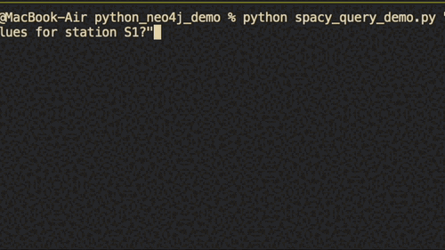

# Python Neo4j Project with SpaCy

This project demonstrates how to use Python, Neo4j, and SpaCy to create and query a graph database.

## Python Dependencies
```bash
pip install -r requirements.txt
```
## SpaCy Language Model
Next, download the English language model for SpaCy by running:
```bash
python -m spacy download en_core_web_sm
```
## Docker and Neo4j
In order to run Neo4j locally, you will need to have Docker installed. 
You can start a Neo4j instance using Docker by running the following command:
```bash
docker run \
    -p7474:7474 -p7687:7687 \
    -v $HOME/neo4j/data:/data \
    -v $HOME/neo4j/logs:/logs \
    -v $HOME/neo4j/import:/var/lib/neo4j/import \
    -v $HOME/neo4j/plugins:/plugins \
    --env NEO4J_AUTH=none \
    neo4j:latest
```
## Usage
After installing the necessary dependencies and starting your Neo4j instance, you can run the Python scripts in this project.

### add rows
```bash
python add_rows.py
```

### query the database with spaCy
```bash
python spacy_query_demo.py "What are the contract values for station S1?"
```
